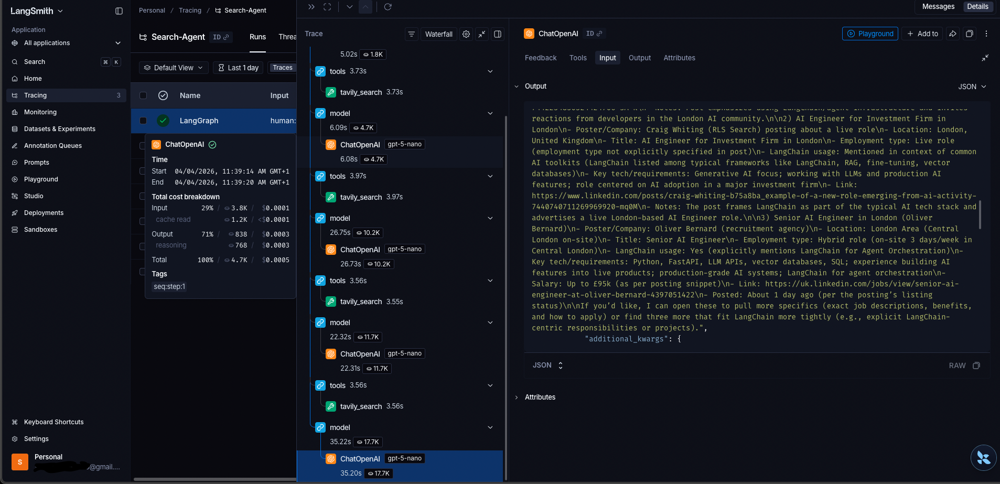

# LangChain Search Agents

This folder demonstrates how to build search agents using LangChain's `create_agent` interface and progresses through three key concepts, showing how to evolve from a basic custom tool implementation to using structured outputs with built-in LangChain integrations.

## 🧠 What is an AI Agent?

An agent is an LLM that can decide what to do next, instead of you hard‑coding every step.

It does 3 things:

1. Thinks (LLM decides what action/tool is needed)
2. Acts (executes that tool)
3. Observes (reads the tool result)
4. Repeats until it can answer the user

This loop is the core of agentic behavior.

The Agent Loop:

Here’s the exact cycle:

**User asks → LLM decides → LLM calls a tool → Tool returns data → LLM reasons again → Final answer**

This is called ReAct (Reason + Act).

### Example:
```bash
Step 1 — User asks
“What is the weather in London?”

Step 2 — LLM decides
“I need to call the search tool.”

Step 3 — LLM acts
Calls the tool:
search("weather in London")

Step 4 — Tool returns
“Rainy, 12°C”

Step 5 — LLM reasons again
“Now I can answer the user.”

Step 6 — LLM responds
“It’s rainy and 12°C.”

```
This loop is what makes it an agent, not just a chatbot.

## 🧩 Key Components of an Agent

1. **LLM**  
   - The brain  
   - Decides what to do next  

2. **Tools**  
   Functions the agent can call, such as:  
   - Web search  
   - Calculator  
   - Database query  
   - Python code  
   - API calls  

3. **Agent Executor**  
   Runs the loop:  
   - think  
   - act  
   - observe  
   - repeat  

4. **Memory (optional)**  
   - Stores past interactions  

## Learning Objectives

- Understand the LangChain `create_agent` interface
- Build custom tools using the `@tool` decorator
- Integrate third-party search APIs (Tavily)
- Use LangChain's built-in tool integrations
- Implement structured outputs with Pydantic models

## Screenshots

### Search Agent with langchain_tavily


## How to run
1. Install dependencies:
   ```bash
   uv add tavily-python langchain-tavily
   ```

2. Set environment variables:
   ```bash
   # Create a .env file with:
   OPENAI_API_KEY=your_openai_key
   TAVILY_API_KEY=your_tavily_key
   ```

3. Run:
   ```bash
   python react_search_agent.py
   ```

## Example Query

The agent searches for AI engineer job postings in the London Area on LinkedIn:
```python
"search for 3 job postings for an ai engineer using langchain in the London area on linkedin and list their details?"
```

## Key Takeaways

- **Custom Tools**: You can create custom tools using the `@tool` decorator for specialized functionality
- **Built-in Integrations**: LangChain provides pre-built tools that reduce boilerplate and improve maintainability
- **Structured Outputs**: Using Pydantic models with `response_format` ensures type-safe, predictable agent responses
- **Agent Interface**: The `create_agent` function provides a simple, consistent interface for building agents with different capabilities
