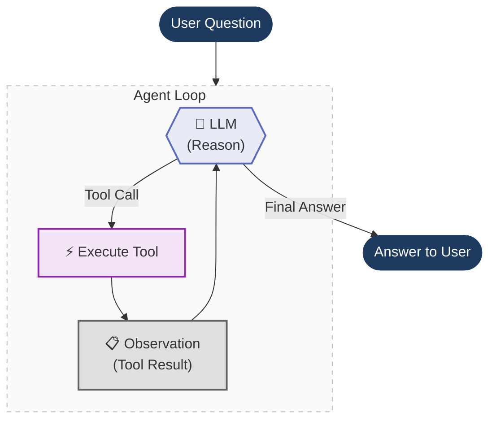
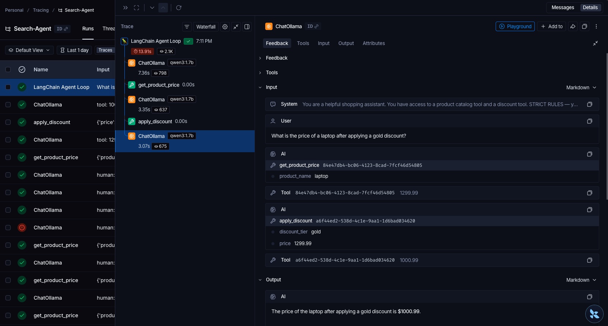
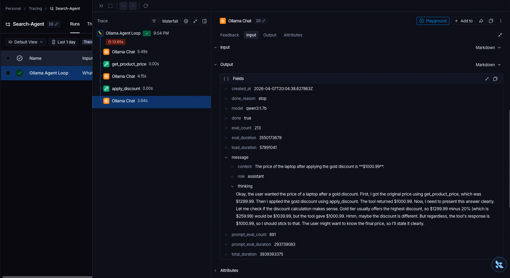

# Agents Under the Hood

**Peeling back the layers of a LangChain agent — from high-level abstractions down to raw prompt engineering.**

In this section we build the **same shopping assistant agent** three different ways. Each time we remove a layer of abstraction, so you can see exactly what's happening underneath.

## The Big Idea

Every AI agent — whether built with LangChain, LlamaIndex, CrewAI, or from scratch — follows the same core loop. We build it three times, each time peeling off a layer:

1. **Start with LangChain** — this is how you'd normally build an agent. `@tool`, `bind_tools()`, `init_chat_model()`. It just works. But what's actually happening underneath?
2. **Peel off LangChain** — build the same agent from scratch using only the Ollama SDK. Now you see what LangChain was doing for you: hand-written JSON schemas, manual message routing, raw tool dispatch.
3. **Peel off function calling** — go even deeper. Modern LLMs have built-in function calling, but that's a recent feature (June 2023). Before that, agents worked through pure prompt engineering: the **ReAct pattern**. We strip away function calling entirely and build it with just a prompt template and regex.

```
┌─────────────────────────────────────────────┐
│  File 1: LangChain                          │  ← @tool, bind_tools(), ToolMessage
│  ┌────────────────────────────────────────┐ │
│  │  File 2: Raw Function Calling          │ │  ← Hand-written JSON schemas, ollama.chat()
│  │  ┌─────────────────────────────────┐   │ │
│  │  │  File 3: Raw ReAct Prompt       │   │ │  ← Prompt template, regex, scratchpad
│  │  └─────────────────────────────────┘   │ │
│  └────────────────────────────────────────┘ │
└─────────────────────────────────────────────┘
```

Each file is self-contained and runnable on its own.

---

## The Agent Loop

At their core, all three implementations share the same loop — the agent reasons, picks a tool, executes it, observes the result, and repeats until it has a final answer:


---

## Implementations

### 1. LangChain Tool Calling
**File:** [`1.agent_loop_langchain_tool_calling.py`](1.agent_loop_langchain_tool_calling.py)

We start here — this is how you'd normally build an agent. Reading through the code top to bottom:

- **Imports & config** — LangChain, LangSmith, model name
- **Tools** — two plain Python functions decorated with `@tool`. LangChain auto-generates the JSON schema from the function signature and docstring. No manual schema writing needed.
- **Agent loop** — initialise the LLM with `init_chat_model(f"ollama:{MODEL}")`, attach tools with `bind_tools()`, then loop: invoke the LLM, check if it returned tool calls, execute the tool, append a `ToolMessage`, repeat.

**What LangChain gives you:**
- `@tool` → auto-generates JSON tool schema from your function
- `init_chat_model()` → swap providers by changing one string (`"ollama:qwen3"` → `"openai:gpt-4o"`)
- `bind_tools()` → attaches tool definitions to the LLM
- `ToolMessage` → handles the tool result format
- Typed message objects (`SystemMessage`, `HumanMessage`) instead of raw dicts

It just works. But what's actually happening underneath all these abstractions?

**Stack:** `langchain`, `langsmith` for tracing


- Langsmith Link: [Trace](https://eu.smith.langchain.com/public/93f7a10f-1080-4adb-99d5-6b3577c1b8c3/r)
---

### 2. Raw Function Calling (No LangChain)
**File:** [`2.agent_loop_raw_function_calling.py`](2.agent_loop_raw_function_calling.py)

Now we peel off LangChain and build the exact same agent using only the `ollama` Python SDK. Compare with file 1 side-by-side to see what LangChain was doing for you. Reading top to bottom:

- **Imports & config** — just `ollama` and `langsmith`. No LangChain.
- **Tools** — the same two Python functions, but now they're just plain functions (no `@tool` decorator).
- **Tool registry** — a simple dict mapping tool names to functions. In file 1, LangChain built this for you with `{t.name: t for t in tools}`.
- **JSON tool schemas** — hand-written JSON dictionaries describing each tool's name, description, and parameters. This is what `@tool` auto-generated in file 1. You can see how verbose it is.
- **Agent loop** — call `ollama.chat()` directly, pass the JSON schemas as `tools=`, check `response.message.tool_calls`, dispatch with `tools[name](**args)`, append raw `{"role": "tool"}` dicts to the message history.

**What you see without LangChain:**
- Tool schemas are ~30 lines of JSON you have to write by hand
- Messages are plain dicts (`{"role": "system", "content": "..."}`) instead of typed objects
- Tool results are appended as `{"role": "tool", "content": result}` instead of `ToolMessage`
- Switching to a different provider (OpenAI, Anthropic) means rewriting the SDK calls, message format, and tool schema format

**Stack:** `ollama` SDK, `langsmith` for tracing


- Langsmith Link: [Trace](https://eu.smith.langchain.com/public/25d3332b-e83f-4ee7-b266-ddedc185b2fa/r)

---