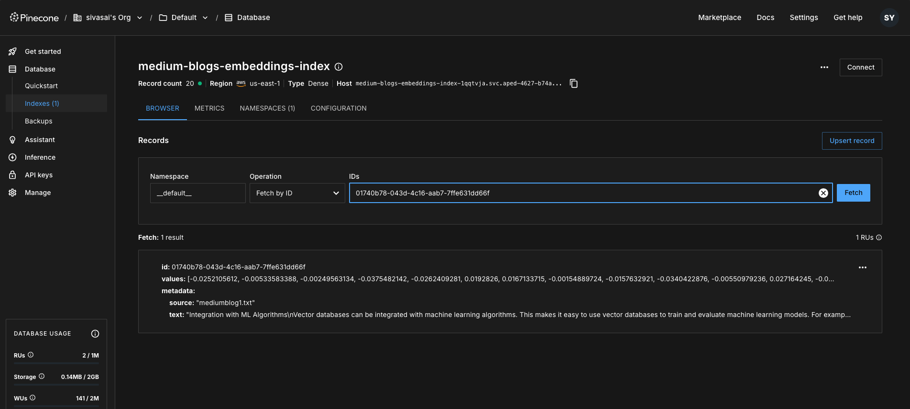
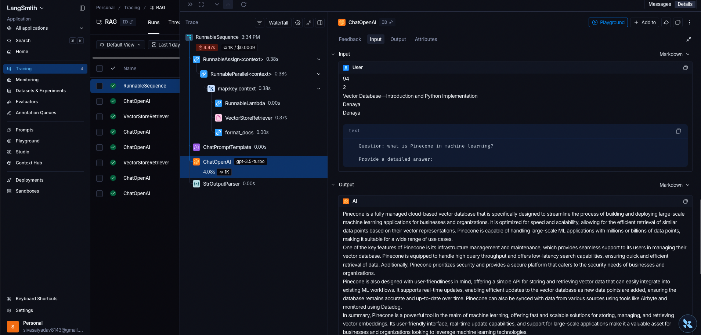

# RAG with LangChain

A step-by-step demonstration of how to build a Retrieval Augmented Generation (RAG) system using LangChain, OpenAI, and Pinecone.

## Overview

This Section progressively builds a complete RAG pipeline:
1. **Document Ingestion** - Load, chunk, embed, and store documents in a vector database
2. **Naive RAG** - Implement a basic retrieval chain using manual function calls
3. **LCEL RAG** - Refactor to use LangChain Expression Language for a cleaner, more powerful approach

## Key Components

### Ingestion (`ingestion.py`)
- **TextLoader**: Load documents from text files
- **CharacterTextSplitter**: Split documents into manageable chunks (1000 chars)
- **OpenAIEmbeddings**: Convert text chunks to vector embeddings
- **PineconeVectorStore**: Store and index vectors for similarity search

### Retrieval (`main.py`)
- **Raw LLM**: Direct query to LLM (no context) - baseline comparison
- **Naive RAG**: Manual retrieval → format → prompt → LLM pipeline
- **LCEL RAG**: Declarative chain using `|` operator with built-in streaming/async

### Screenshots
- **Pinecone**:
 
- **Langsmith**:

## Why LCEL?

The Section demonstrates two approaches to building RAG:

| Feature | Naive Approach | LCEL Approach |
|---------|----------------|---------------|
| Code style | Imperative | Declarative |
| Streaming | Manual implementation | Built-in `.stream()` |
| Async | Manual implementation | Built-in `.ainvoke()` |
| Composability | Limited | Pipe operator `\|` |
| Batch processing | Manual loops | Built-in `.batch()` |

## Technologies

- **LangChain** - Framework for building LLM applications
- **OpenAI** - Embeddings and chat completions
- **Pinecone** - Vector database for similarity search
- **Python** - 3.12+
