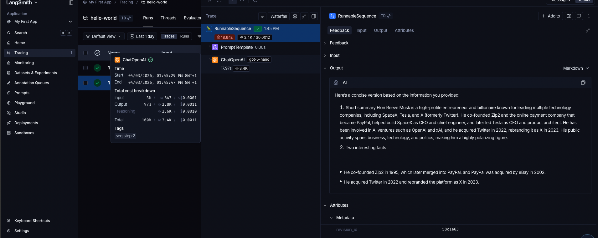
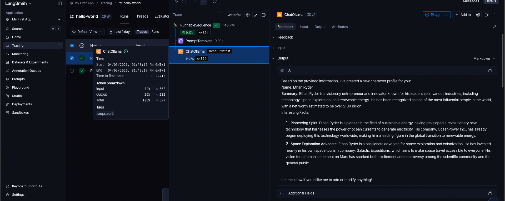

# LangSmith Tracing Practice

This folder contains experiments using LangSmith to trace LLM calls with:
- OpenAI models
- Ollama local models

## What this demonstrates
- How to initialize LangSmith client
- How to trace LLM calls
- How to compare OpenAI vs Ollama behavior
- How to inspect traces in the LangSmith UI

## Screenshots

### OpenAI Trace

### Ollama Trace

## Example Traces
- OpenAI trace: [OpenAI](https://eu.smith.langchain.com/public/a4afbe99-9ee2-4c26-92e9-a33e3dcc2828/r)
- Ollama trace: [Ollama](https://eu.smith.langchain.com/public/94a51837-03da-4918-a3e9-8bb8a3b24c57/r)

## How to run
1. Install dependencies:
   - pip install langchain langchain-openai langchain-ollama langsmith

2. Set environment variables:
   - export LANGCHAIN_API_KEY=<your-key>
   - export LANGSMITH_TRACING=true
   - export LANGCHAIN_PROJECT=<your-project-name>
   - export LANGSMITH_ENDPOINT=https://eu.api.smith.langchain.com

3. Run:
   - python openai_trace_example.py
   - python ollama_trace_example.py
